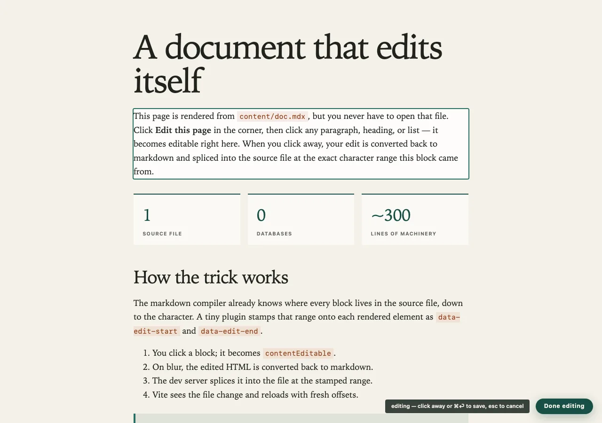

# selfdoc

[](https://deepwiki.com/kevinmichaelchen/selfdoc)

**A document that edits itself.**

Click a paragraph. Type. Click away. Your edit is converted back to markdown
and spliced into the `.mdx` source file at the exact character range that
paragraph came from.

No CMS. No database. No admin panel. `git diff` is the audit log.



## The trick

Every markdown compiler knows where each block lives in the source file, down
to the character — and then throws that away. We keep it.

1. A tiny plugin stamps each rendered block with its source range.
2. Clicking a block makes it editable in place.
3. On blur, the HTML converts back to markdown and splices into the file at
   that exact range.

Everything else falls out of that loop. Adding a paragraph? A splice with an
empty range. Deleting one? A splice with an empty replacement. The hover
toolbar is just those splices with buttons on.

## Run it

```sh
pnpm install
pnpm dev
```

Write in `content/*.mdx`. Every doc gets a card on the home page.

## What's inside

**✏️ Edit** — prose is editable in the page: paragraphs, headings, lists,
quotes, even text inside components. Bold, links, code, and citations survive
the round trip.

**🎙 Narration** — you're forced to hear your own prose. Hover a section, hit
the mic, and a 3-second countdown drops you into a live take with a waveform
of your voice — then you listen back before keeping it. Silence is trimmed
automatically. A small speech model (on your machine, dev only) pins every
word to its moment, so playback highlights the word being spoken and skips
your pauses. Rewrite a sentence and its audio goes stale until you read it
again. Readers get a ▶ that plays from any section onward.

**✍ Provenance** — proof of care, measured. Sessions, days, active time
(idle tabs count nothing), edits landed, words moved, and typed-vs-pasted
keystrokes — pasting a wall of generated prose leaves a visible signature.
Stored in git beside the source; ships with every export.

**💬 Comments** — feedback at any zoom: a phrase (select it first), a block,
a section, or the whole doc. Reactions, grades, and a sidebar listing
everything in document order. One click exports it all as JSON — with the
text each comment targets — ready to hand to an agent. Lives in the reader's
browser, never in the file.

**⧉ Copy as markdown** — the whole source, one click, straight to your
agent's context window.

Plus the quiet stuff: a table of contents with per-section read times, a
reading-progress ring, Tufte-style margin notes, footnote citations, and a
🌡 writing-lint mode (parked behind a flag while we rethink it).

## Ship it

```sh
pnpm export                # one self-contained HTML file
DOC=colophon pnpm export   # any doc by name
AUDIO=1 pnpm export        # narration inlined (topbar dropdown does this too)
```

Exports carry only that doc — other drafts stay out of the bundle. Works from
`file://`. Editing never ships. Pushes to `main` deploy the whole site to
GitHub Pages, narration included.

## The rules that keep it sane

| What | Lives in | Because |
| --- | --- | --- |
| Prose | the page | editing where you read |
| Structure & props | the `.mdx` file | structure belongs in source |
| Reader feedback | the reader's browser | marginalia isn't the document |
| Provenance & audio | git, beside the source | proof should travel |
| TOC, read times, heat | derived at render | can never drift from the source |

One rule above all: **nothing gets a second home.** The file is the document;
everything else is derived from it or deliberately kept out of it.

## Honest limits

Component props aren't inline-editable yet, tables and endnotes are
file-edited, rewriting a block orphans its comments and audio (reverting
revives them), and feedback is single-reader until the sync server exists.
All tracked in [ROADMAP.md](ROADMAP.md), along with the gated local-model
reading assistant.

## Standing on

- **TiddlyWiki** — proved a document can be its own editor, twenty years ago.
- **MDX + remark** — whose source positions are the load-bearing fact here.
- **turndown** — the way back from HTML to markdown.
- **Tufte** — the margin notes.
- **TinaCMS** — the productized cousin, and the off-ramp if this ever needs
  multi-user editing.
