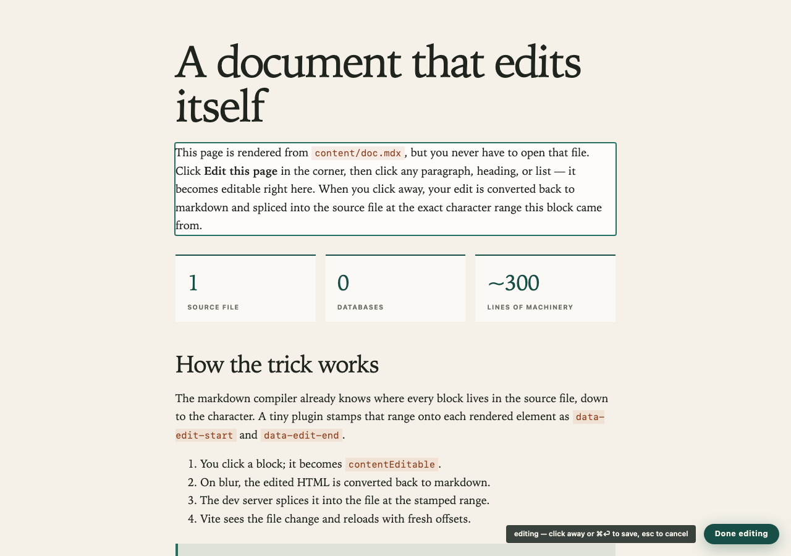

# selfdoc

A document that edits itself.



Content lives in MDX files. The rendered page — typography, callouts, stat
rows, margin notes, whatever components you add — doubles as the editor: toggle
edit mode, click any paragraph, type, click away. The edit is converted back to
markdown and spliced into the `.mdx` source at the exact character range the
block came from. No database, no CMS, no admin panel. `git diff` is the audit
log.

## Run it

```sh
pnpm install
pnpm dev
```

- **✏️ Edit** (bottom right, dev only) — click a block to rewrite it; hover a
  block for the toolbar: **+ ¶** add paragraph, **+ note** add margin note,
  **✕** delete (components too).
- **💬 Comment** — feedback at every zoom level: click a block to annotate it;
  select a phrase first to annotate exactly those words (highlighted amber);
  click a heading for section-level notes; the **whole doc** button for global
  ones. Plus one-tap reactions (😕 lost me · 📝 needs margin note · 👏 kudos)
  and an overall grade. Reader-state in localStorage; never touches the file.
- **🌡 Heat** — derived writing lint: long blocks, run-on sentences, dense
  vocabulary, low Flesch scores, em-dash pileups, filler words. Hover a
  highlighted block for its signals. Stored nowhere.
- **✍ Provenance** (topbar stamp) — the document's watermark, measured not
  asserted: sessions and distinct days, active time (heartbeats only count
  with real input in the last 30s — idle tabs accrue nothing), edit-mode
  time, edits landed, words added/removed (computed server-side from each
  splice), and typed vs pasted characters (paste events are tallied
  separately — bulk-pasting generated prose shows up as exactly that).
  Accrues across drafts in `content/provenance/<doc>.json` beside the source,
  baked into the export for readers.
- **⧉ Copy md** (topbar) — one click copies the document's raw markdown
  source, so readers can hand the whole post to their agents.
- **Progress ring** (bottom left) — reading progress; click it for a table of
  contents with per-section reading times. A `<Toc />` component renders the
  same thing inline.
- **Citations** — standard markdown footnotes (`[^id]`), rendered as endnotes.
  Refs round-trip through inline edits; you can even type a new `[^ref]` into a
  paragraph and add its definition in the file.
- **Multiple docs** — every `content/*.mdx` gets a topbar link
  (`?doc=colophon`).

## Share it

```sh
pnpm export   # dist/index.html — one self-contained file
```

The export inlines all docs, the reading chrome, commenting/reactions, heat,
and provenance into a single HTML file that works from `file://`. Editing is
dev-only and excluded.

## How it works

1. **`plugins/rehype-source-pos.mjs`** — the markdown compiler already knows
   the character offsets of every block in the source file. This rehype plugin
   stamps them onto prose blocks as `data-edit-start`/`end` (text-editable) and
   onto JSX components as `data-node-start`/`end` (removable as a unit; their
   prose children stay editable). Nested blocks are skipped so ranges never
   overlap; the generated endnotes section is skipped because HTML→markdown
   has no footnote syntax to round-trip through.
2. **`src/editor-core.js`** — clicking a stamped block makes it
   `contentEditable`. On blur, [turndown](https://github.com/mixmark-io/turndown)
   converts the edited HTML back to markdown (custom rule so citation refs
   come back as `[^id]`; `{` and `<` escaped outside code so a stray brace
   can't break the MDX compile) and POSTs it with the block's range.
   Insertion is the same splice with `start == end`.
3. **`vite.config.mjs`** — a dev-only middleware (`/__save`) splices the
   replacement into the file at that range, allowlisted to `content/*.mdx`,
   and bumps the doc's provenance edit count server-side. A sibling endpoint
   (`/__provenance`) receives time heartbeats from `src/provenance.js` and
   merges them into the JSON sidecar; builds bake the sidecars in via
   `define`.

The reading chrome (`src/chrome.jsx`) and heat signals (`src/heat.js`) are
derived from the rendered DOM after mount — never stored, so they can't
conflict with editing. Annotations (`src/comments.js`) anchor to a hash of
each block's text: stable across edits elsewhere, orphaned if the block itself
is rewritten.

## The boundary that makes it sane

- **Prose** (paragraphs, headings, lists, quotes) → edit in the page.
- **Structure** (components, their props, document order beyond
  add/delete-after) → edit in the MDX file, where structure belongs.
- **Reader state** (comments, reactions, grades) → localStorage, never the
  file.
- **Authorial provenance** → measured, not asserted; a JSON sidecar beside the
  source.

## Known limits

- Component props (a stat's `value`, a callout's `title`) aren't inline-editable
  yet (see ROADMAP).
- Tables and the endnotes section render but are file-edited — their
  HTML→markdown conversion isn't trustworthy enough to write back.
- Round-tripping normalizes formatting: source line-wrapping collapses to one
  line per paragraph on first edit; exotic pasted HTML becomes whatever
  turndown makes of it.
- Annotations on a block are orphaned if that block's text is rewritten.
- Reactions and grades are single-reader until the feedback server exists
  (see ROADMAP).

See [ROADMAP.md](ROADMAP.md) for what's logged but deliberately not built:
revision compare (draft vs canonical), reader feedback sync, and the
read-only local-model assistant.

## Prior art

- **TiddlyWiki** — the original "quine" wiki: a single HTML file that edits and
  re-saves itself. Spiritual ancestor.
- **TinaCMS** — the productized version of this idea (visual MDX editing,
  git-backed). The off-ramp if this pattern needs multi-user editing.
- **Tufte CSS** — the margin-note tradition the `<Note>` component borrows.
- **Obsidian / Typora** — live-preview markdown editors; same instinct,
  different direction (editor that renders vs. render that edits).
